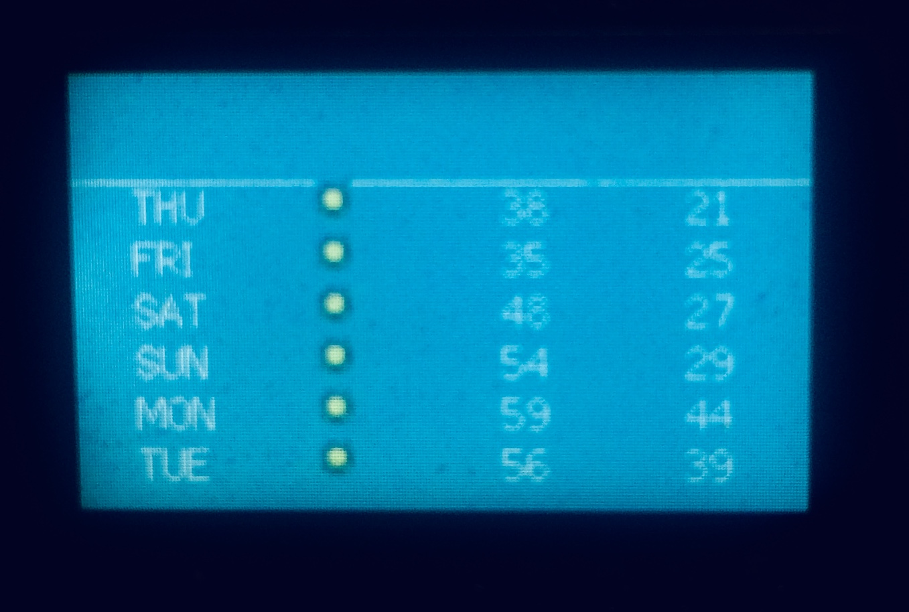
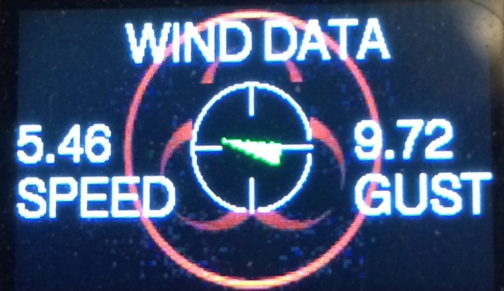

# DarkSkySevenDay v1.0.0

Current and Seven Day Weather Information from Dark Sky

copyright 2020 - Jessica Hershey

www.github.com/JHershey69

******* ATTENTION PLEASE********

This library will be obsolete as of OCTOBER 2020
DarkSky has been sold to Apple and is no longer accepting new API Key requests
A NEW LIBRARY IS IN THE MAKING AND WILL BE AVAILABLE SOON

********************************

DarkSkySevenDay.h

Required items:

**Google API Key** / 
**Dark Sky API Key** / 
**HTTPClient.h** / 
**ArduinoJson.h**

Weekly Forecast provides weather data for **NOW** and **7 days in the future**. Using your **WiFi connection only** (no GPS required) and your **Google API Key**, Weekly Forecast triangulates your location and then requests the future forecast from Dark Sky Weather with your **Dark Sky API Key**. No need to worry about setting up the http requests, filters, or finding your location. Let Weekly Forecast do it all for you.

All you need to do is install the library as you would any other (clone, download, or use the Arduino Library Manager… highly suggested as dependency libraries are installed at the same time). Then simply call **getWeather(“your google key”,”your dark sky key”)** and sit back while weather information downloads to your device.

<b>PLEASE USE WHATEVER GRAPHICS DRIVER YOU USE FOR YOUR DEVICE AND SET 
  it up accordingly. This library only gets information from the DarkSky Service.</b> 

Setup like this:

DarkSkySevenDay forecast; //←------------ Invoke the library 

**-------------------------------------------------------------------**

VARIABLES for Current local weather conditions  
**Examples follow the variable, all times are LONG in EPOCH format (GMT), decimal numbers are FLOATS**
  
forecast.current.dayTime; // 1582151288  
forecast.current.summary; // "Clear" 
forecast.current.icon; // "clear-day" 
forecast.current.nearestStormDistance; // 50 
forecast.current.nearestStormBearing; // 4 
forecast.current.precipIntensity; // 0 
forecast.current.precipProbability; // 0 
forecast.current.temperature; // 46.38 
forecast.current.apparentTemperature; // 41.49 
forecast.current.dewPoint; // 17.18 
forecast.current.humidity; // 0.31 
forecast.current.pressure; // 1026.4 
forecast.current.windSpeed; // 10.22 
forecast.current.windGust; // 10.22 
forecast.current.windBearing; // 348 
forecast.current.cloudCover; // 0.02 
forecast.current.uvIndex; // 0 
forecast.current.visibility; // 10 
forecast.current.ozone; // 323.4 

**--------------------------------------------------------**
 
VARIABLES for Seven Day Forecast  

**Examples follow the variable, all times are LONG in EPOCH format (GMT), decimal numbers are FLOATS** 
forecast.forecastDay[x].dayTime; // 1582088400 
forecast.forecastDay[x].summary; // "Partly cloudy throughout the day." 
forecast.forecastDay[x].icon; // "partly-cloudy-day" 
forecast.forecastDay[x].sunriseTime; // 1582112760 
forecast.forecastDay[x].sunsetTime; // 1582151880 
forecast.forecastDay[x].moonPhase; // 0.89 
forecast.forecastDay[x].precipIntensity; // 0.0009 
forecast.forecastDay[x].precipIntensityMax; // 0.0028 
forecast.forecastDay[x].precipIntensityMaxTime; // 1582105560 
forecast.forecastDay[x].precipProbability; // 0.3 
forecast.forecastDay[x].precipType; // "rain" 
forecast.forecastDay[x].temperatureHigh; // 51.24 
forecast.forecastDay[x].temperatureHighTime; // 1582139280 
forecast.forecastDay[x].temperatureLow; // 26.83 
forecast.forecastDay[x].temperatureLowTime; // 1582199760 
forecast.forecastDay[x].apparentTemperatureHigh; // 50.76 
forecast.forecastDay[x].apparentTemperatureHighTime; // 1582139100 
forecast.forecastDay[x].apparentTemperatureLow; // 19.9 
forecast.forecastDay[x].apparentTemperatureLowTime; // 1582199940 
forecast.forecastDay[x].dewPoint; // 26.79 
forecast.forecastDay[x].humidity; // 0.54 
forecast.forecastDay[x].pressure; // 1024.1 
forecast.forecastDay[x].windSpeed; // 6.49 
forecast.forecastDay[x].windGust; // 24.15 
forecast.forecastDay[x].windGustTime; // 1582131600 
forecast.forecastDay[x].windBearing; // 324 
forecast.forecastDay[x].cloudCover; // 0.53 
forecast.forecastDay[x].uvIndex; // 3 
forecast.forecastDay[x].uvIndexTime; // 1582134180 
forecast.forecastDay[x].visibility; // 10 
forecast.forecastDay[x].ozone; // 322.6 
forecast.forecastDay[x].temperatureMin; // 30.17 
forecast.forecastDay[x].temperatureMinTime; // 1582174800 
forecast.forecastDay[x].temperatureMax; // 51.24 
forecast.forecastDay[x].temperatureMaxTime; // 1582139280 
forecast.forecastDay[x].apparentTemperatureMin; // 24.39 
forecast.forecastDay[x].apparentTemperatureMinTime; // 1582174800 
forecast.forecastDay[x].apparentTemperatureMax; // 50.76 
forecast.forecastDay[x].apparentTemperatureMaxTime; // 1582139100 
 
Please have your **Dark Sky Key**, available at www.darksky.net and your **Google API key** available at https://developers.google.com/maps/documentation/javascript/get-api-key
 
As usual, if you have any questions just contact me and we’ll get you all on track.
  
**DISPLAY USE IDEA**
 

  
**GNU General Public License v3.0**

Permissions of this strong copyleft license are conditioned on making available complete source code of licensed works and modifications, which include larger works using a licensed work, under the same license. Copyright and license notices must be preserved. Contributors provide an express grant of patent rights.
